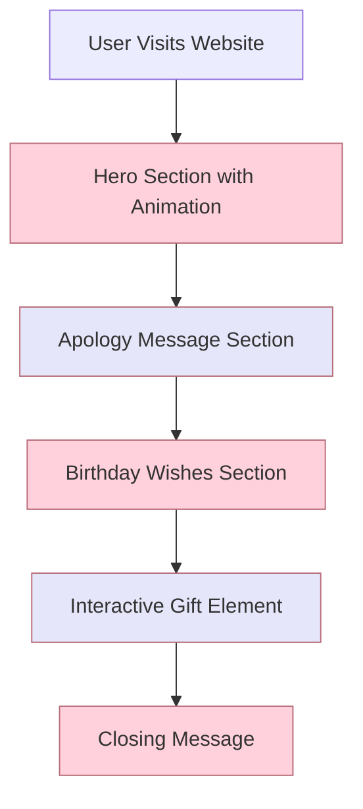

# Birthday Apology Website - Detailed Plan

Based on your requirements, I'll design a beautiful, elegant, and sincere birthday apology website that can be quickly deployed. Here's my comprehensive plan:

## Project Structure

```
Gift/
├── index.html          # Main HTML file
├── css/
│   ├── style.css       # Main stylesheet
│   └── animations.css  # CSS for animations
├── js/
│   ├── main.js         # Main JavaScript file
│   └── animations.js   # JS for complex animations
├── assets/
│   ├── images/         # Background images, icons
│   ├── fonts/          # Custom fonts (if needed)
│   └── audio/          # Background music (optional)
└── README.md           # Instructions for deployment
```

## Design Elements

### Color Palette
- Primary: Soft pink (#FFD1DC)
- Secondary: Lavender (#E6E6FA)
- Accent: Rose gold (#B76E79)
- Text: Dark gray (#333333) and white (#FFFFFF)
- Backgrounds: Gradient from white to soft pink

### Typography
- Headings: Elegant serif font (e.g., "Playfair Display")
- Body text: Clean sans-serif font (e.g., "Montserrat")
- Both fonts will be loaded from Google Fonts for reliability

### Layout
- Single-page design with sections that fade in as the user scrolls
- Centered content with appropriate whitespace
- Responsive design with media queries for mobile devices

## Content Sections

### 1. Hero Section
- Full-screen background with subtle gradient
- Elegant animated entrance of the main apology heading
- Floating hearts or gentle sparkles animation

### 2. Apology Message
- Heartfelt, sincere apology text
- Animated text reveal or fade-in effect
- Decorative elements (like hand-drawn borders)

### 3. Birthday Wishes
- Beautiful birthday message
- Animated cake or gift illustration
- Option for background music toggle (user-initiated for better UX)

### 4. Interactive Element
- Digital gift section with one of these options:
  - Virtual bouquet of flowers that "bloom" on hover
  - Interactive card that opens when clicked
  - Countdown timer to a promised real-life date/gift

### 5. Closing Message
- Final heartfelt message
- Call-to-action (e.g., "Call me" button that links to phone)
- Subtle floating hearts animation

## Technical Implementation

### HTML Structure
- Semantic HTML5 elements
- Proper meta tags for SEO and social sharing
- Responsive viewport settings

### CSS Features
- Flexbox/Grid for layouts
- CSS animations for simple effects
- Media queries for responsiveness
- CSS variables for easy color scheme adjustments

### JavaScript Functionality
- Smooth scrolling between sections
- Animation triggers based on scroll position
- Interactive elements (countdown timer, virtual gift)
- Optional: Background music toggle

### Animations
- Entrance animations for text and elements
- Continuous subtle animations (floating hearts, sparkles)
- Interactive animations on hover/click
- Performance optimization for mobile devices

### Responsiveness
- Mobile-first approach
- Breakpoints for different device sizes
- Touch-friendly interactive elements
- Testing on multiple device sizes

## Deployment Strategy

The website will be built as static files that can be deployed through any of these methods:

1. **Direct Hosting**: Upload files to any web hosting service
2. **GitHub Pages**: Push to a GitHub repository and enable GitHub Pages
3. **Netlify/Vercel**: Connect to repository or drag-and-drop the folder
4. **Local Deployment**: Open index.html directly in a browser to test

## Implementation Timeline

1. **Setup Project Structure** - Create directories and files
2. **Develop HTML Structure** - Build the semantic backbone
3. **Style with CSS** - Implement the visual design
4. **Add Basic Animations** - Create the core animation effects
5. **Implement JavaScript Functionality** - Add interactive elements
6. **Optimize for Mobile** - Ensure responsive design
7. **Testing & Refinement** - Test across devices and browsers
8. **Deployment** - Prepare for easy deployment

## Mermaid Diagram: Website Flow



## Mermaid Diagram: Technical Components

```mermaid
graph TD
    A[index.html] --> B[style.css]
    A --> C[animations.css]
    A --> D[main.js]
    A --> E[animations.js]
    
    B --> F[Layout & Typography]
    B --> G[Color Scheme]
    B --> H[Responsive Design]
    
    C --> I[Entrance Animations]
    C --> J[Continuous Animations]
    C --> K[Interactive Animations]
    
    D --> L[Scroll Behavior]
    D --> M[Interactive Elements]
    D --> N[Countdown Timer]
    
    E --> O[Complex Animation Logic]
    E --> P[Animation Triggers]
    
    style A fill:#FFD1DC,stroke:#333
    style B,C,D,E fill:#E6E6FA,stroke:#333
    style F,G,H,I,J,K,L,M,N,O,P fill:#FFF,stroke:#B76E79